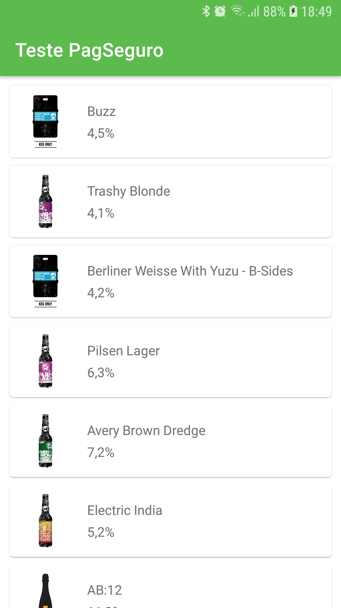
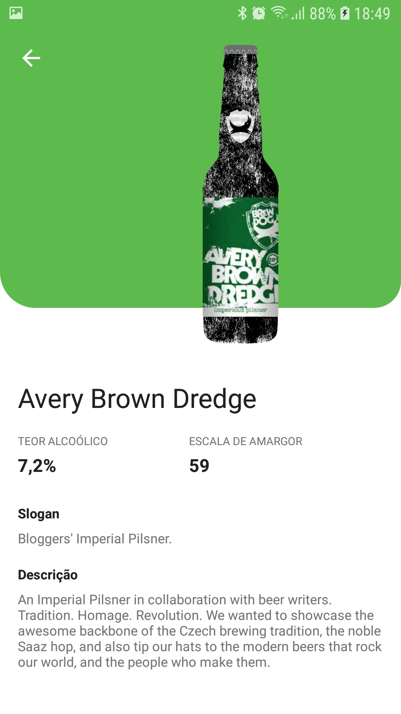

# Aplicativo Teste PagSeguro - Objetivo
Desenvolver um app que consuma uma API e exiba os seus dados. O app deve conter uma tela com a lista de cervejas e outra tela com os detalhes do item
selecionado.

# API
* https://punkapi.com/documentation/v2

## Screenshots
### Home (Beers list)
Essa tela exibe todas as cervejas disponibilizadas no repositório remoto.

### Beer details)
Essa tela exibe os detalhes da cerveja seleciona na lista.

## Arquitetura
* MVVM

## Bibliotecas
* [Jetpack Libraries] (https://developer.android.com/jetpack) - ViewModel, LiveData, View Binding

* [Material] (https://material.io/develop/android) - para injeção de dependência;

* [Coroutines] (https://github.com/Kotlin/kotlinx.coroutines) - para requisições background, para tarefas assíncronas;
* [Retrofit] (https://square.github.io/retrofit) - para simplificar o consumo de webservice/API;
* [Moshi] (https://github.com/square/moshi) - para simplificar a conversão do Json;
* [Koin] (https://github.com/InsertKoinIO/koin) - para injeção de dependência;
* [Glide] (https://github.com/bumptech/glide) - para carregamento assíncrono de imagens.
* [Timber] (https://github.com/JakeWharton/timber) - para facilitar exibição de logs;
* JUnit e [Mockito] (https://github.com/mockito/mockito) -  para teste unitário;
* [Espresso] (https://developer.android.com/training/testing/espresso) - para testes básicos de UI;
